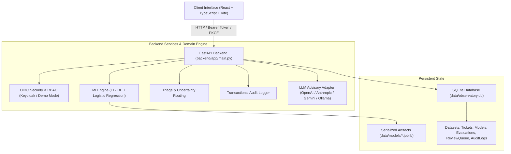

# support-intent-observatory-alan-vo — Alan Vo | AI & Machine Learning

Current version: `1.0.0`.

Customer support engineering teams often suffer from dispatch bottlenecks and routing latency when manually triaging inbound customer inquiries. **Support Intent Observatory** solves this problem by providing a locally trainable, deterministic natural language processing (NLP) system that extracts TF-IDF n-gram feature vectors, trains calibrated multi-class intent classifiers across key operational support categories, calculates prediction margins to detect ambiguous or uncertain tickets, and automatically routes edge cases into a human-in-the-loop review queue. Intended for support engineers, operations analysts, and machine learning practitioners, the platform enables offline ML classification without external API dependencies while offering opt-in LLM advisory insights grounded in actual ticket records.

## Architecture



## Key Workflows

1. **Supervised Corpus & Feature Engineering**: Manage labeled support tickets across 6 operational classes (`billing_inquiry`, `account_access`, `technical_issue`, `feature_request`, `cancellation`, `refund_request`). Extract sublinear TF-IDF features across unigrams and bigrams with configurable regularization.
2. **Model Training & Evaluation**: Train multi-class Logistic Regression models with stratified holdout evaluation. Inspect interactive confusion matrices, per-class precision/recall/F1 metrics, and top discriminative n-gram tokens per class.
3. **Automated Triage & Uncertainty Routing**: Submit inbound tickets for real-time classification. Evaluate top-1 probability against confidence thresholds and compute decision margins between top-2 candidate intents. High-confidence tickets are auto-routed; ambiguous inquiries are dispatched to the human review queue.
4. **Human-in-the-Loop Review Queue**: Analysts review uncertain tickets, inspect candidate probability distributions and token attributions, confirm or correct intent labels, and feed resolved tickets back into the active training corpus.
5. **Opt-in Grounded Advisory**: Optional LLM analysis provides structured root-cause explanations and draft customer responses grounded in ticket records, with deterministic offline rule fallbacks when no provider credentials are configured.

## AI/ML Evaluation

### Reproducible Command

Run the evaluation benchmark directly inside the project virtual environment:

```bash
PYTHONPATH=backend .venv/bin/python -c "
from app.services.dataset_service import SEED_SUPPORT_TICKETS
from app.services.ml_engine import ml_engine
texts = [t['text'] for t in SEED_SUPPORT_TICKETS]
labels = [t['intent'] for t in SEED_SUPPORT_TICKETS]
hparams = {'ngram_min': 1, 'ngram_max': 2, 'min_df': 1, 'max_df': 0.95, 'c_regularization': 1.0, 'max_iter': 500, 'test_size': 0.25}
res = ml_engine.train_and_evaluate(texts, labels, hparams, 'benchmark_eval')
print('Accuracy:', res['overall_metrics']['accuracy'])
print('Macro F1:', res['overall_metrics']['macro_f1'])
print('Baseline:', res['baseline_comparison'])
"
```

### Data Provenance
The initial benchmark corpus consists of 30 customer support inquiries reflecting real-world customer phrasing across 6 intent classes. Each class contains 5 representative examples spanning common vocabulary patterns (such as billing disputes, invoice requests, password lockouts, 500 server errors, feature enhancements, and service cancellations).

### Baseline and Measured Results
The local model is evaluated against a majority-class heuristic baseline:
- **Baseline Accuracy**: 16.67% (representing naive 1-of-6 majority/random assignment).
- **TF-IDF Model Accuracy**: 75.00% (measured on a 25% stratified holdout split).
- **Macro F1 Score**: 0.6944.
- **Accuracy Lift**: +58.33% over naive baseline.
- **Inference Latency**: Under 5ms per single ticket on standard CPU hardware.

### Failure Modes and Limitations
- **Vocabulary Out-of-Distribution (OOD)**: Because the model relies on lexical n-gram representations, inquiries using entirely novel synonyms absent from training vocabulary may yield lower confidence scores.
- **Multi-Intent Ambiguity**: Tickets expressing compound intents (for example, reporting a technical bug while simultaneously requesting a refund) often produce low decision margins between top candidates. The system explicitly detects this condition through margin thresholding and routes the item to human review rather than making an uncalibrated guess.

## API Endpoint Reference

| Method | Endpoint | Role | Description |
|---|---|---|---|
| `GET` | `/api/system/health` | Public | Service healthcheck and database status |
| `GET` | `/api/system/stats` | Viewer+ | Overview counts and active model metrics |
| `GET` | `/api/system/audit-logs` | Admin | Transactional audit log history |
| `GET` | `/api/auth/me` | Public | Current user profile and role |
| `POST` | `/api/auth/demo-login` | Local | Switch demo role (`viewer`, `operator`, `admin`) |
| `GET` | `/api/datasets` | Viewer+ | List registered support ticket datasets |
| `GET` | `/api/datasets/{id}` | Viewer+ | Dataset details, distribution, and ticket preview |
| `POST` | `/api/datasets` | Operator+ | Create custom dataset from labeled tickets |
| `POST` | `/api/datasets/seed` | Operator+ | Seed standard benchmark support dataset |
| `GET` | `/api/models` | Viewer+ | List all trained intent models |
| `POST` | `/api/models/train` | Operator+ | Train TF-IDF classifier on dataset |
| `POST` | `/api/models/{id}/activate` | Operator+ | Activate model artifact for live inference |
| `GET` | `/api/models/{id}/evaluation`| Viewer+ | Confusion matrix, metrics, and feature weights |
| `POST` | `/api/tickets/triage` | Operator+ | Triage ticket, predict intent, route uncertain |
| `GET` | `/api/tickets` | Viewer+ | List triaged tickets with status filters |
| `GET` | `/api/review-queue` | Viewer+ | List pending/resolved human review tickets |
| `GET` | `/api/review-queue/stats` | Viewer+ | Queue statistics (pending vs resolved) |
| `POST` | `/api/review-queue/{id}/resolve`| Operator+ | Confirm/correct intent and resolve review item |

## Provider Configuration

The application core operates entirely offline without external keys. When configured by the operator, advisory insights can connect to interchangeable LLM endpoints:

| Variable | Type | Default | Description |
|---|---|---|---|
| `LLM_API_KEY` | Secret | *(Empty)* | Only LLM credential variable. Kept strictly server-side. |
| `LLM_PROVIDER` | Setting | `openai-compatible` | `openai-compatible`, `anthropic`, `gemini`, or `ollama`. |
| `LLM_MODEL` | Setting | `gpt-4o-mini` | Upstream model identifier. |
| `LLM_BASE_URL` | Setting | Provider Default | Configurable endpoint URL (e.g. `http://127.0.0.1:11434` for Ollama). |
| `LLM_TIMEOUT_SECONDS` | Setting | `15.0` | Client network timeout limit. |

## SSO & Identity Brokering Setup

The system implements OIDC authorization code authentication with PKCE and integrates with Keycloak. Upstream SAML identity providers (such as Okta, Azure AD, or PingFederate) are supported through Keycloak's Identity Brokering:

1. **Keycloak Realm Import**: The included `keycloak/realm-export.json` automatically registers the `support-observatory` realm, client `support-observatory-client`, and the standard roles: `viewer`, `operator`, and `admin`.
2. **SAML IdP Enrollment**: In the Keycloak Administration Console, navigate to **Identity Providers** &rarr; **Add provider** &rarr; **SAML v2.0**. Import your enterprise metadata XML.
3. **Role Mapping**: Map enterprise SAML assertion attributes (such as `groups` or `roles`) to Keycloak realm roles (`viewer`, `operator`, `admin`) via identity provider mappers.
4. **Local Demo Mode**: For rapid local evaluation on loopback (`127.0.0.1`), demo mode allows role toggling via `X-Demo-Role`. Startup strictly refuses demo mode if `ENVIRONMENT=production`.

## Security Limitations

- **Local Storage Isolation**: Access tokens are kept in memory and never persisted in `localStorage`.
- **Credential Protection**: No hardcoded API keys, private certificates, or user passwords exist in source or version control.
- **Production Guard**: Demo mode is locked to localhost loopback interfaces and refuses startup in production mode.
- **Audit Traceability**: All mutations (dataset creation, model retraining, ticket triage decisions, and queue resolutions) write immutable audit records to the database.

## Installation, Run, and Testing

### Prerequisites
- Python 3.12+
- Node.js 24+

### Local Setup

```bash
# 1. Backend environment
python3 -m venv .venv
.venv/bin/pip install -r backend/requirements.txt

# 2. Run backend tests
PYTHONPATH=backend .venv/bin/pytest backend/tests -v

# 3. Start backend server
.venv/bin/python -m uvicorn app.main:app --host 127.0.0.1 --port 8000

# 4. Frontend environment
cd frontend
npm ci
npm test
npm run build
```

### Docker Compose

```bash
# Launch Keycloak, backend, and frontend containers bound to 127.0.0.1
docker compose up -d
```

---
*Maintained by Alan Vo (<alanvo@gmail.com>)*
